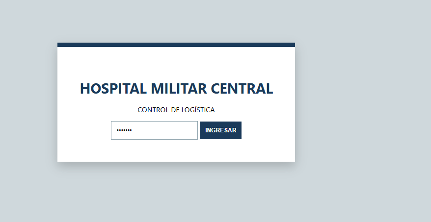
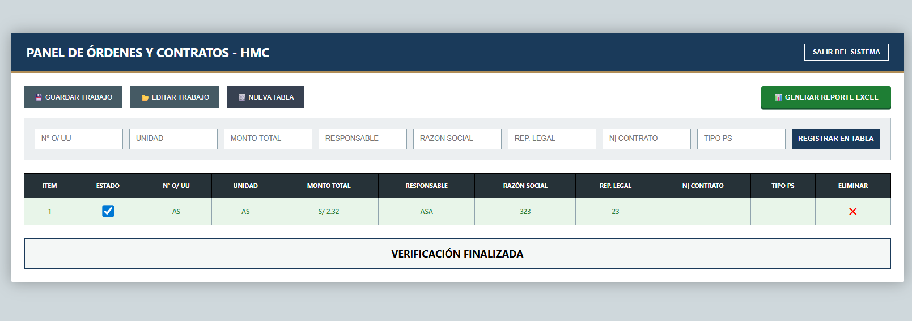

  <h1>Sistema de Control HMC - Órdenes y Contratos</h1>

Este proyecto lo saqué adelante porque en el hospital era un caos manejar todo con papeles y archivos de Excel que cualquiera borraba por error. Me enfoqué en armar un panel local que sea seguro y que automatice lo más pesado: que los montos cuadren y que no se te pase ni un solo contrato por verificar.

---

### Ejecución

* **Lógica pura con JS:** No quería que la página esté cargando a cada rato, así que usé JavaScript para que todo sea al toque. Los datos viven en el `localStorage`, así que si se te apaga la PC o cierras la ventana sin querer, no pierdes ni un solo dato.
* **Base de datos portátil:** Le metí un sistema para exportar e importar todo en archivos `.json`. Esto sirve para que puedas bajar tu trabajo en un USB y seguir en cualquier otra máquina dándole al botón de "Editar Trabajo".
* **Reportes automáticos:** Me bajé las librerías `ExcelJS` y `FileSaver` para que el sistema te bote un reporte oficial en `.xlsx`. No es un Excel simple; sale con los colores del hospital, bordes y negritas, listo para entregar a auditoría.
* **Seguridad real:** El sistema tiene un login con clave obligatoria. No es solo por facha, es para asegurar que solo la gente de logística pueda mover las tablas.

---

### Eficiencia 

* **Cero errores en montos:** Mientras vas tipeando el dinero, el sistema te pone el "S/." y las comas solo, así te evitas fallos de digitación.
* **Edición rápida:** Si ves algo mal en la tabla, haces clic en la celda y corriges ahí mismo (`contenteditable`), se guarda al instante.
* **Check de verificación:** Metí un validador que revisa todos los contratos y recién cuando todo está en orden te suelta el aviso de "VERIFICACIÓN FINALIZADA".

---

### 📸 VISTAS DEL SISTEMA

**Acceso con Clave de Seguridad**

**Panel Principal y Gestión de Datos**

---

  Chamba enfocada en que los datos no fallen y la logística sea más rápida.

